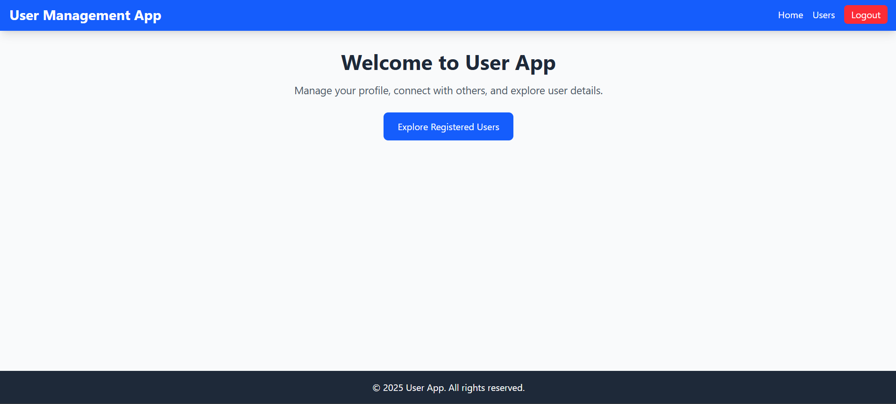

# Simple User Management App

## Overview
A full-stack web app with React frontend, Node.js/Express backend, and MySQL database.  
Features:
- User registration  
- Login with JWT authentication  
- Protected user list page with extra details  
- Update and delete users  

## Prerequisites
- Node.js
- MySQL

## Setup
1. **Backend**:
   - Navigate to `backend/`
   - Run `npm install`
   - Create `.env` with:
     ```
     DB_HOST=your_db_host
     DB_USER=your_db_user
     DB_PASSWORD=your_db_password
     DB_NAME=usersdb
     JWT_SECRET=your_secret_key
     ```
   - Run `npm start` (backend runs on http://localhost:5000)

2. **Frontend**:
   - Navigate to `frontend/`
   - Run `npm install`
   - Run `npm run dev` (frontend runs on http://localhost:5173)

3. **Database**:
   - Create MySQL database `usersdb`
   - Tables auto-create on backend start

## Usage
- **Register**: `/register`
- **Login**: `/`
- **User List (Protected)**: `/users`
- **Update User**: From the user list, edit details of an existing user
- **Delete User**: From the user list, remove a user

## Security Notes
- Passwords hashed with bcrypt
- JWT for authentication (expires in 1 hour)

## Screenshots
- **Login**:  
  
- **Register**:  
  
- **Home (Logged In)**:  
  
- **Home (Not Logged In)**:  
  
- **User List**:  
  
- **Update User**:  
  
- **Delete User**:  
  
