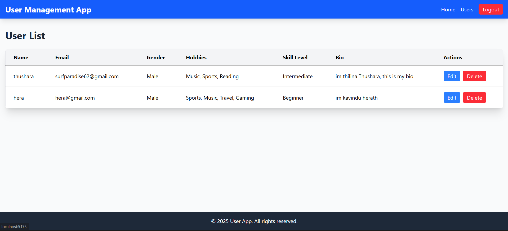

# Simple User Management App

## Overview
A full-stack web app with React frontend, Node.js/Express backend, and MySQL database. Features user registration, login with JWT auth, and a protected user list page displaying extra user details.

## Prerequisites
- Node.js
- MySQL

## Setup
1. **Backend**:
   - Navigate to `backend/`
   - Run `npm install`
   - Create `.env` with DB_HOST, DB_USER, DB_PASSWORD, DB_NAME, JWT_SECRET
   - Run `npm start` (runs on http://localhost:5000)

2. **Frontend**:
   - Navigate to `frontend/`
   - Run `npm install`
   - Run `npm start` (runs on http://localhost:3000)

3. **Database**:
   - Create MySQL database `usersdb`
   - Table auto-creates on backend start

## Usage
- Register at /register
- Login at /
- View users at /users (protected)

## Security Notes
- Passwords hashed with bcrypt
- JWT for auth (expires in 1h)

## Screenshots
- **Login**:  
  
- **Register**:  
  
- **Home (Logged In)**:  
  
- **Home (Not Logged In)**:  
  
- **User List**:  
  